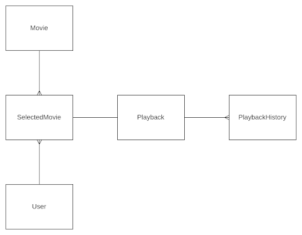

# NoFLIX

Proof of Concept (PoC) for testing authentication and authorization in Django.

## Rationale

There are several well-known streaming services such as Netflix, Amazon Prime,
and others.

Subscribers are the users of the system. They can browse and unlock movies or
series, then play or stop the content.

This platform is a much lighter version of a streaming service, focused on a
simplified data model for users, movies, and playbacks.